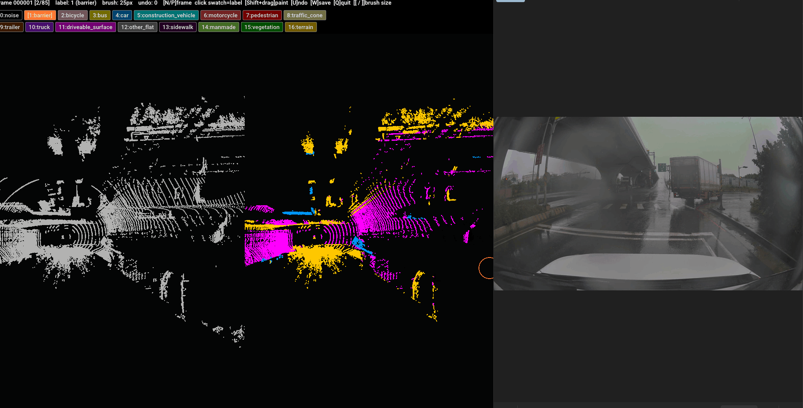

# 3D Point Cloud GT Annotator

An interactive Ground-Truth (GT) annotation tool for 3D point clouds, aimed at
autonomous-driving LiDAR semantic-segmentation tasks.

It provides a **split-view 3D paint brush** (built on the modern Open3D GUI)
for quickly correcting predicted per-point labels using the
**nuScenes lidarseg 16-class** scheme.

The window is split into two panels:
- **Left** — raw LiDAR point cloud (`VLS128_pcd`) for visual reference
- **Right** — semantic label cloud (paintable); both panels share the same camera



---

## Folder structure

```
point_clouds_annotator/
├── gt_annotator.py
├── readme.md
├── demo.gif
│
└── scenes/
    └── <scene_name>/
        ├── colored_360_pcd_filter/     ← prediction labels + annotation output
        │   ├── 000000.pcd
        │   ├── 000000_labels.npz       ← input: predicted per-point labels
        │   ├── 000000_gt.npz           ← output: saved GT labels (after annotating)
        │   ├── 000000_gt.pcd           ← output: GT cloud coloured by label
        │   └── ...
        ├── images/                     ← camera images for visual reference
        │   ├── main/
        │   ├── left/
        │   ├── right/
        │   ├── rear/
        │   ├── sideL/
        │   └── sideR/
        └── VLS128_pcd/                 ← raw LiDAR PCD (shown in left panel for reference)
```

---

## Setup

### 1. Clone the repository

```bash
git clone <repo-url>
cd point_clouds_annotator
```

### 2. Create a Python environment

```bash
conda create -n annotator python=3.10 -y
conda activate annotator
pip install "numpy==1.23.0" "open3d>=0.15.1"
```

> Tested with **Python 3.10, numpy 1.23.0, open3d 0.15.1**.
> The annotator uses the modern Open3D GUI (`open3d.visualization.gui`).
> Do **not** mix it with the legacy `draw_geometries` in the same process —
> the legacy viewer calls `glfwTerminate()` on close, which breaks all later
> GUI windows.

### 3. Configure the scene to annotate

Open `gt_annotator.py` and set `PRED_FOLDER` to the `colored_360_pcd_filter`
folder of the scene you want to annotate:

```python
# gt_annotator.py — top of file
PRED_FOLDER = r"C:\path\to\point_clouds_annotator\scenes\<scene_name>\colored_360_pcd_filter"
```

`RAW_FOLDER` is derived automatically from `PRED_FOLDER` (looks for a sibling
`VLS128_pcd` folder). If it does not exist the left panel is hidden.

To jump directly to a specific frame instead of picking interactively:

```python
TARGET_FRAME = "000042"   # or leave as None to pick on startup
```

### 4. Run

```bash
conda activate annotator
python gt_annotator.py
```

---

## Recommended workflow

Each scene folder contains an `images` subfolder with 6 camera views
(`main`, `left`, `right`, `rear`, `sideL`, `sideR`) matching the LiDAR frames.

**Open the images in a separate viewer alongside the annotator window** — use
the camera images as visual reference to identify objects, then paint the
correct label on the point cloud.

A typical annotation session:

1. Run `gt_annotator.py` and pick a frame.
2. Open the corresponding frame images from `images/` in a separate window.
3. Rotate the point cloud to a clear viewing angle.
4. Click a label swatch in the top panel to select a class.
5. Hold **Shift** and drag over the points to paint.
6. Use **`N`** / **`P`** to move to the next / previous frame — the current
   frame is auto-saved if there are unsaved changes.
7. Press **`Q`** to save and quit when done.

---

## Annotation controls (3D window)

The window is split left (raw) / right (label). A status bar and two rows of
clickable label swatches sit across the top; the brush ring follows your cursor
on the right panel.

| Action / Shortcut        | Description |
|--------------------------|-------------|
| **Left-drag**            | Rotate the view (both panels stay in sync) |
| **Mouse wheel**          | Zoom |
| **Shift + left-drag**    | **Paint** points under the brush with the current label |
| **Click a top swatch**   | Select target label |
| **`[` / `]`**            | Shrink / grow the brush radius |
| **`N` / `P`**            | Next / previous frame (auto-saves if there are unsaved changes) |
| **`U`**                  | Undo the last paint stroke (up to 20 steps) |
| **`W`**                  | Save GT — status bar flashes **Saved ✓** for 2 seconds |
| **`Q`**                  | Save and quit |
| **`X`**                  | Quit without saving — shows a confirmation dialog if there are unsaved changes |

Notes:
* The brush paints **through** the cloud — every on-screen point under the ring
  is painted, including occluded points behind. Rotate to an angle where only
  the target points are in front.
* If you paint the wrong label, either undo with **`U`** or simply repaint the
  area with the correct label — painting is always overwrite.
* Brush size and selected label **persist** when switching frames; undo history
  resets per frame.

---

## Input / Output format

Each `*_labels.npz` must contain:

| Key      | Shape  | Description                |
|----------|--------|----------------------------|
| `points` | (N, 3) | XYZ coordinates            |
| `labels` | (N,)   | integer class id per point |
| `colors` | (N, 3) | RGB per point              |

Saving a frame writes two files next to the prediction file:

| File | Description |
|------|-------------|
| `<frame>_gt.npz` | Corrected `points` + `labels` |
| `<frame>_gt.pcd` | Cloud coloured by label, for quick external viewing |

---

## Label definitions (nuScenes lidarseg 16-class)

Index `0` (noise) is the ignore class. Indices `1`–`16` are the 16 evaluated
classes following the official nuScenes challenge ordering.

| ID | Name | Definition |
|----|------|------------|
| 0  | noise | Any lidar return that does not correspond to a physical object — dust, vapor, fog, raindrops, smoke, reflections. **Ignored during evaluation.** |
| 1  | barrier | Temporary road barriers placed in the road, e.g. concrete barriers, plastic barriers, Jersey barriers. |
| 2  | bicycle | Human-powered or motor-assisted bicycle (≤ 0.25 kW). **Includes the rider if present.** |
| 3  | bus | Rigid, articulated, or bendy bus designed for passenger transport. |
| 4  | car | Passenger car, MPV, SUV, or other small personal vehicle. |
| 5  | construction_vehicle | Vehicle primarily used for construction — cranes, dumpers, excavators, cement mixers, etc. |
| 6  | motorcycle | Motorbike / scooter / moped. **Includes the rider if present.** |
| 7  | pedestrian | Person on foot. Includes people in wheelchairs, strollers, personal mobility devices. |
| 8  | traffic_cone | Cone-shaped markers placed on the road to redirect traffic or mark hazards. |
| 9  | trailer | Trailer towed by a car, truck, or bus. Also tram / train cars. |
| 10 | truck | Truck or pick-up truck designed for cargo transport. |
| 11 | driveable_surface | All paved or unpaved surfaces a car can drive on — road, parking lot, driveway. |
| 12 | other_flat | Horizontal ground-level structures not covered by the above — traffic islands, rail tracks, water bodies. |
| 13 | sidewalk | Pavement designated for pedestrians or cyclists, including bike paths. Does not need to be adjacent to a road. |
| 14 | manmade | Static man-made structures — buildings, walls, fences, poles, guard rails, traffic lights, street signs. |
| 15 | vegetation | Any vegetation taller than ground level — trees, bushes, plants. |
| 16 | terrain | Natural horizontal surfaces — grass, rolling hills, soil, sand, gravel, low vegetation (< 20 cm). |

---

## Troubleshooting

| Symptom | Cause / fix |
|---------|-------------|
| `No *_labels.npz found in ...` | `PRED_FOLDER` is wrong or missing the `colored_360_pcd_filter` subfolder. Use an absolute path. |
| `GLFW Error: The GLFW library is not initialized` | A legacy `draw_geometries` window ran in the same process. Run the annotator in a fresh terminal. |
| Window opens then immediately closes | Pressed `X` / `Q` or closed the window. Re-run to reopen. |
| Brush ring not visible / wrong size | Adjust with `[` / `]`. The ring sits at scene-centre depth. |
